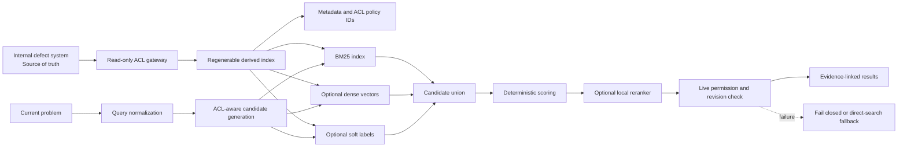
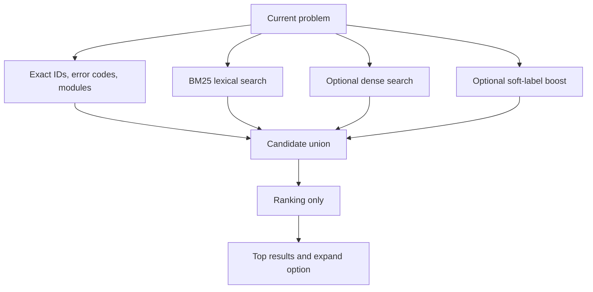

# 과거 결함 검색용 Operational Memory Retrieval 도입 검토

> 상태: `검토된 설계 가설`이며 도입 권고나 성능 보장이 아니다.
> 공개 범위: 합성 예시와 일반화된 시스템 구성만 포함한다. 실제 회사명, 시스템명, 필드명, URL, 계정, 결함 ID, 데이터 규모 및 측정값은 포함하지 않는다.
> 대상 환경 가정: 64 GB RAM, NVIDIA RTX 3070급 8 GB VRAM. 실제 회사 PC의 소프트웨어, 접근권한, 네트워크 정책과 성능은 별도로 확인해야 한다.

## 1. 검토 대상

해결된 과거 결함을 현재 문제의 조사 선례로 검색하는 로컬 시스템을 검토한다. 원본 결함 시스템은 진실의 원천으로 유지하고, 검색에 필요한 파생 인덱스는 삭제 후 재생성할 수 있도록 분리한다.

검토 대상은 다음 네 단계다.

1. 현행 결함 검색
2. 접근권한 필터와 BM25 전문 검색
3. 로컬 dense retrieval 추가
4. 선택적 로컬 소형 LLM reranker 추가

코드 수정, 원인 확정, 결함 종결과 외부 시스템 쓰기는 범위에 포함하지 않는다.

## 2. 외부 연구에서 확인된 범위

[OM-RAG 연구](https://arxiv.org/abs/2607.21911)는 해결된 이슈를 `symptom`, `root cause`, `resolution` 구조로 변환하고 단일 레코드 검색을 수행했다. 논문은 1,172건의 Dataverse 이슈를 평가했으며, 구조화된 과거 장애 이력이 일반 chunk 검색과 문서 중심 그래프보다 높은 진단 성능을 보였다고 보고했다.

이 결과는 다음 이유로 회사 환경의 예상 성능으로 사용할 수 없다.

- 단일 Dataverse 시스템의 이력을 사용했다.
- 구조화와 임베딩에 외부 모델·API를 사용했다.
- 최종 진단과 주 평가에 대형 모델을 사용했다.
- 전체 평가의 주 판정자는 LLM이었고, 사람 검토는 부분집합에 수행됐다.
- 로컬 Qwen 계열 모델과 8 GB VRAM 회사 PC는 검증 대상이 아니었다.

따라서 연구 결과는 `해결된 결함을 구조화된 사례로 검색하면 유용할 수 있다`는 가설의 근거이며, 로컬 구성 채택의 증거는 아니다.

## 3. 중립적 참조 구조

파생 인덱스는 단순 캐시가 아니라 별도의 보안 데이터 저장소로 취급한다. 원본의 접근제어, 삭제, 보존기간과 권한 철회를 후보 생성 단계부터 반영해야 한다.

## 4. 원본과 파생 인덱스의 역할

| 구분 | 역할 | 권위 | 실패 시 처리 |
|---|---|---|---|
| 원본 결함 시스템 | 원문, 상태, 권한, 최신 revision 제공 | 유일한 진실의 원천 | 직접검색 또는 작업 중단 |
| 파생 인덱스 | 후보 ID와 검색 신호 생성 | 비권위·재생성 가능 | 폐기 후 전체 재생성 |
| 자동 유형·태그 | 순위 보조 | 추정 | 무시해도 검색 가능해야 함 |
| 로컬 reranker | 후보 순서와 근거 설명 보조 | 추정 | BM25 결과로 fallback |

자동 유형은 접근제어, hard filter 또는 후보 삭제에 사용하지 않는다. 미분류와 오분류 결함도 원문 BM25와 dense 경로로 검색될 수 있어야 한다.

## 5. 후보 누락을 줄이는 검색 방식

각 검색 경로에는 독립적인 최소 후보 quota를 둔다. 한 경로의 점수가 낮다는 이유로 다른 경로의 후보를 생성 단계에서 삭제하지 않는다. `Top 3` 결과 외에 후보 확장과 원본 직접검색 경로를 제공한다.

검색 점수는 원인 동일성의 확률로 표현하지 않는다. 다음 항목을 분리한다.

- 검색 관련도: 현재 현상·조건과 얼마나 유사한가
- 기록 근거 완성도: 과거 원인·대책·검증 기록이 존재하는가
- 현재 적용 가능성: 제품 계보·버전·구조가 현재에도 유효한가

## 6. 단계별 비교안

| 옵션 | 구성 | 장점 | 비용·위험 | 다음 단계 조건 |
|---|---|---|---|---|
| A | 현행 검색 | 추가 시스템 없음 | 현재 검색 한계 유지 | 기준선으로 측정 |
| B | ACL 필터 + BM25 | 결정적·설명 가능·CPU 운용 가능 | 동의어·표현 차이에 약할 수 있음 | A보다 유용 결함 발견시간과 Recall 개선 |
| C | B + 로컬 dense retrieval | 표현이 다른 유사 현상 검색 가능성 | embedding, 인덱스, 보안·운영 부담 증가 | 동일 후보 예산에서 B보다 held-out Recall 개선 |
| D | C + 로컬 소형 LLM reranker | 후보 설명과 순위 보조 가능성 | 비결정성, VRAM, 지연, 근거 왜곡 위험 | C보다 사용자 판정이 개선되고 p95·자원 기준 충족 |

가장 단순한 B부터 평가한다. C와 D는 독립 실험으로 취급하며, 앞 단계보다 의미 있는 개선이 없으면 추가하지 않는다.

## 7. 회사 PC 검증 계획

### 데이터셋

- 시간 순서로 train/reference 구간과 held-out query 구간을 분리한다.
- 질의 자체의 결함, 복제 결함과 미래에 생성된 결함은 검색 후보에서 제외한다.
- 개발자 2명 이상이 `현상 유사`, `조사에 유용`, `원인 유사`를 분리 판정한다.
- 제품군, 희귀 결함, 미분류 결함, 한국어·영어·약어 혼용 slice를 포함한다.

### 검색 품질

- 후보 생성 Recall@50
- 최종 Recall@3 및 Recall@10
- MRR 또는 nDCG
- 무관 결과 비율
- 관련 결함이 없는 질의의 거절 성능
- 첫 유용 결함을 발견하는 데 걸린 시간
- 결과에 표시된 근거가 최신 원문 필드와 일치하는 비율

Top-3만 평가하지 않는다. 후보 생성 Recall과 최종 순위를 분리해야 reranker 이전의 누락을 확인할 수 있다.

### 회사 PC 성능

- 설치 버전과 package hash
- cold/warm 시작시간
- p50·p95 응답시간
- RAM·VRAM·디스크 사용량
- CPU-only fallback 성능
- 동시 사용자 수에 따른 처리량
- 전체 재색인 및 증분 동기화 시간
- 로컬 모델 OOM·장애 시 BM25 fallback 여부

측정 전에는 Qwen 2.5 7B가 8 GB VRAM에서 요구 성능을 충족한다고 단정하지 않는다.

## 8. 보안·운영 수용 조건

다음 조건을 모두 충족하기 전에는 실제 사내 데이터로 운영하지 않는다.

1. 후보 생성 전에 사용자별 최신 원본 시스템 권한을 적용한다.
2. 권한 철회·삭제·원문 변경이 정한 허용시간 안에 색인에 반영된다.
3. 원문 revision 불일치, live re-fetch 실패, 근거 필드 부재 시 fail-closed 처리한다.
4. 인덱스·벡터·query log·prompt cache·backup의 암호화, 보존, 삭제 절차가 정의돼 있다.
5. reranker에는 도구 실행, 원본 변경과 외부 네트워크 권한을 부여하지 않는다.
6. 원본 시스템의 자유서술은 비신뢰 데이터로 구획하고 고정 출력 schema를 검증한다.
7. 모델·embedding·tokenizer·prompt·가중치·index snapshot을 버전으로 기록한다.
8. immutable index bundle과 atomic switch를 사용해 이전 버전으로 rollback할 수 있다.
9. 외부 쓰기·업로드·메시지·배포는 별도의 사람 승인 절차를 거친다.

## 9. 외부 데이터 경로 검토표

실제 구성요소가 선정되기 전까지 다음 항목은 `회사 확인 필요`다.

| 항목 | 확인 내용 | 초기 정책 |
|---|---|---|
| 모델 런타임 | 소유자, source, 읽기 가능한 파일·환경변수 | 승인된 로컬 경로만 |
| Embedding 도구 | 입력 데이터, endpoint, telemetry | outbound 차단 |
| Plugin·MCP·extension | 읽기 범위, 전송 데이터, 목적지 domain | 기본 비활성 |
| Package 설치 | registry, hash, subprocess, post-install | 사전 검토·고정 버전 |
| 로그·trace·crash report | 원문·질의·후보 포함 여부, 보존기간 | redaction·최소 보존 |
| 인증 | 읽기 전용 계정, secret 저장소, 회전 | 승인된 vault 또는 OS store |
| 네트워크 | DNS, 목적지 allowlist, proxy·방화벽 기록 | deny by default |
| 제거·사고 대응 | 서비스 중지, token 폐기, cache·backup 삭제 | 사전 runbook 필요 |

“로컬”이라는 설명만으로 데이터 무전송을 보장하지 않는다. 패킷 캡처, DNS·방화벽 로그와 구성 검토로 외부 통신이 없음을 확인해야 한다.

## 10. 동기화와 최신성

표시 직전 원문 재조회는 선택된 레코드의 최신성만 확인한다. 오래된 색인이 신규·수정 결함을 후보로 만들지 못한 문제는 해결하지 못한다.

따라서 다음을 함께 적용한다.

- 증분 변경 동기화
- 주기적 전체 ID·revision 대조
- source watermark와 마지막 성공 시각 표시
- 신규·수정·삭제·권한 철회 이벤트별 지연 측정
- freshness 기준 초과 시 검색 중단 또는 원본 직접검색 fallback

## 11. Auto-grill 판정

검토 경로: `Deep`

| 결정 | 판정 | 신뢰도 | 조건 |
|---|---|---|---|
| 원본과 파생 인덱스 분리 | `revise` | 높음 | 파생 인덱스를 별도 보안 저장소로 관리하고 ACL·삭제·revision 동기화 필요 |
| BM25 + 선택적 dense/Qwen | `revise` | 높음 | BM25를 기준선으로 고정하고 dense·Qwen은 독립 검증 후 추가 |
| 자동 유형을 soft signal로만 사용 | `accept` | 높음 | 후보 삭제·권한·hard filter 사용 금지 |
| Top 결과 live re-fetch | `revise` | 높음 | index freshness gate와 fail-closed가 함께 필요 |
| 단계적 PoC 후 도입 판단 | `accept` | 높음 | 품질·보안·성능·운영 중단 조건 포함 |

가장 강한 잔여 위험은 외부 연구가 로컬 Qwen, 회사 데이터 분포와 8 GB VRAM 환경의 성능을 입증하지 않는다는 점이다. 특히 Top-3 결과만으로는 후보 생성 단계의 false negative를 감출 수 있다.

## 12. 도입·보류·중단 기준

### 다음 단계 진행

- 현행 검색보다 첫 유용 결함 발견시간이 감소한다.
- 후보 생성 Recall@50과 최종 사용자 판정이 사전 기준을 충족한다.
- 권한 위반, 삭제·stale 원문 노출이 0건이다.
- 회사 PC의 p95, RAM·VRAM, 동시성 목표를 충족하거나 fallback이 작동한다.
- 월간 운영·검수 비용이 절감되는 조사시간보다 작다.

### 보류 또는 단순 구성 유지

- BM25가 dense·reranker와 동등한 결과를 낸다.
- 동기화·ACL 유지비가 사용자 이익보다 크다.
- 개발자가 기존 작업 내용을 반복 입력해야 해 사용률이 낮다.
- 시간 분리 평가에서 희귀 결함 또는 다른 제품군의 누락이 크다.

### 중단

- 권한 없는 결함의 ID·제목·snippet·embedding 유사 근거가 노출된다.
- 삭제·권한 철회가 허용시간 안에 반영되지 않는다.
- 외부 통신 목적지나 telemetry를 완전히 식별·차단할 수 없다.
- reranker가 원문에 없는 근거를 반복 생성한다.

## 13. Rollback·제거

1. 검색 서비스를 읽기 전용 BM25 fallback으로 전환한다.
2. 신규 index bundle의 활성 포인터를 이전 검증 버전으로 atomic switch한다.
3. 모델 서버와 증분 동기화 작업을 중지한다.
4. access token을 폐기하거나 회전한다.
5. query cache, prompt cache, vector index와 backup을 보존정책에 따라 삭제한다.
6. 원본 결함 시스템은 변경하지 않는다.
7. 삭제·권한 변경 반영 여부와 외부 통신 종료를 감사 로그로 확인한다.

## 14. 현재 판단

현재 공개 근거만으로는 로컬 dense retrieval 또는 Qwen reranker 도입을 결정할 수 없다. 가장 낮은 위험의 다음 조치는 실제 사내 연결이 아닌 익명화·합성 평가셋에서 `현행 검색 → ACL 필터+BM25 → dense → reranker`를 순차 비교하는 것이다.

각 단계가 동일 후보 예산과 동일 사용자 과제에서 명확한 개선을 보일 때만 다음 계층을 추가하는 것이 중립적인 채택 기준이다.
